<div align ="center">
  
  <h1 algin= "center">Talks</h1>
  <h4>Talks is a Flutter Based Application, Chat Application with Flutter and Firebase, offering real-time messaging, push notifications, and multimedia sharing features for enhanced user interaction.</h4>
</div>


## ScreenShots
<div style="display: flex, flex-direction: row; justify-content:center,align-Items:center">
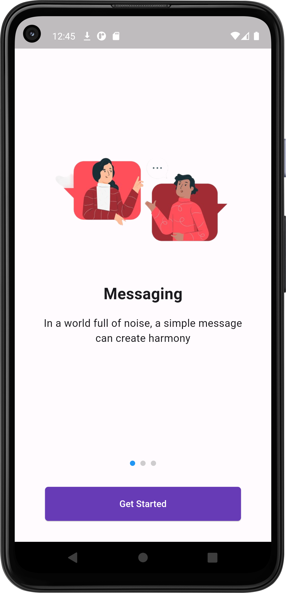
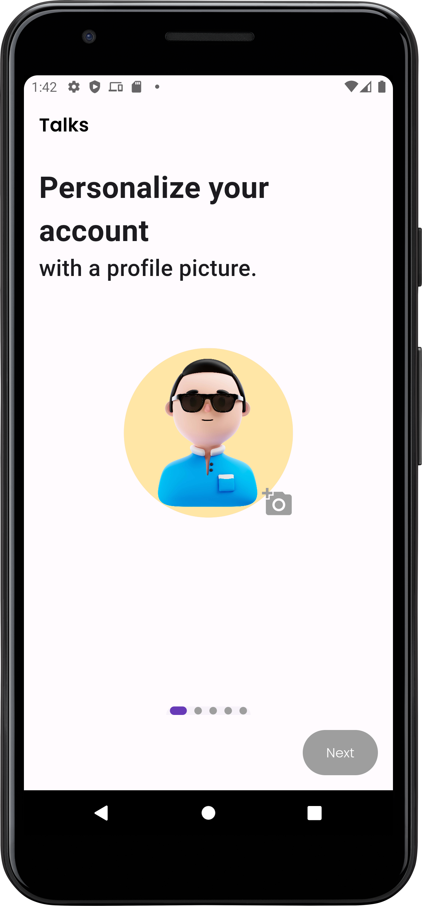
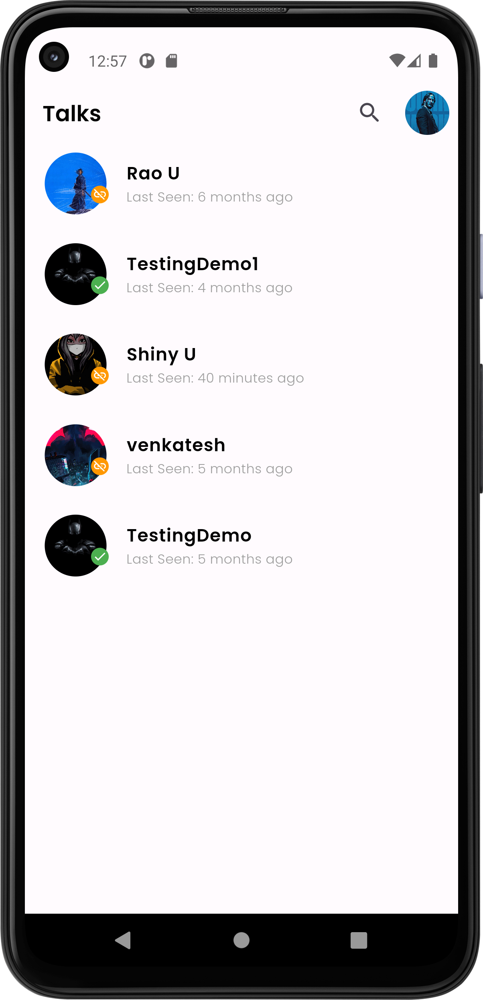
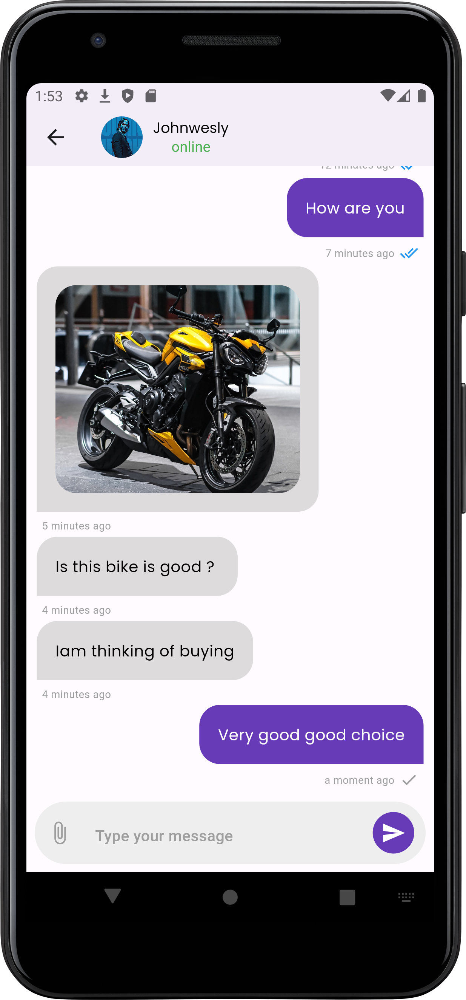
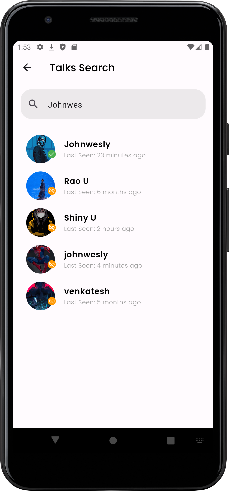
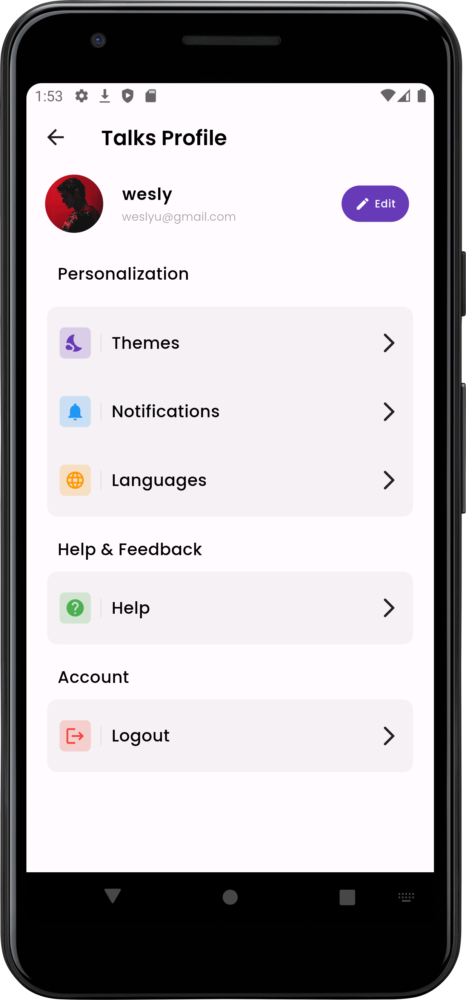
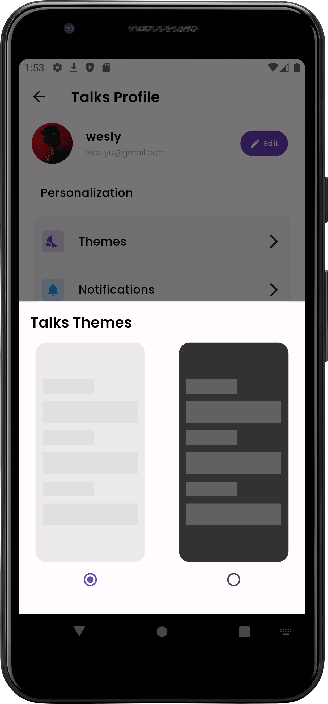
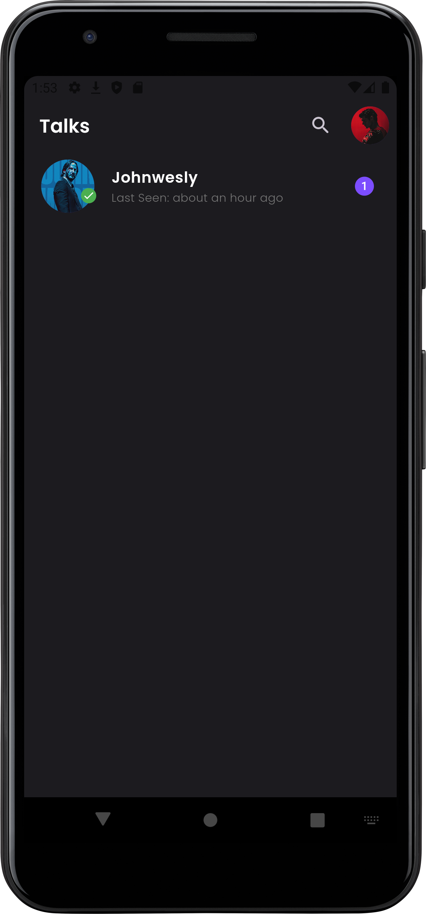
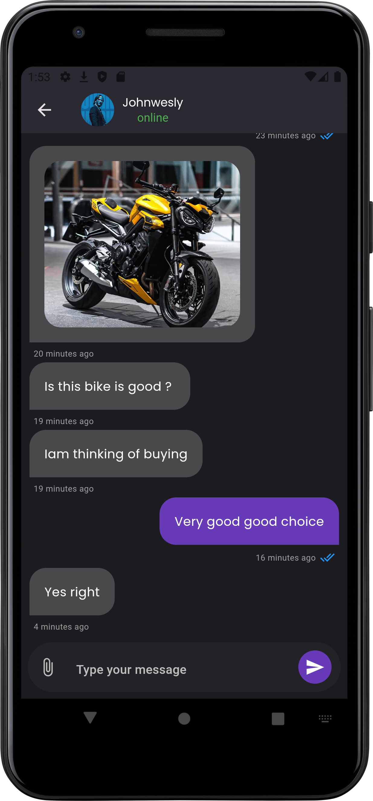
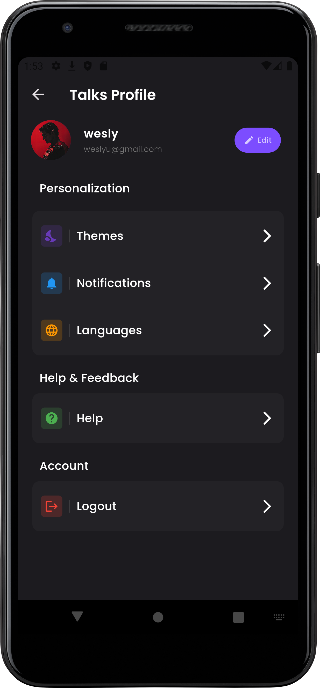
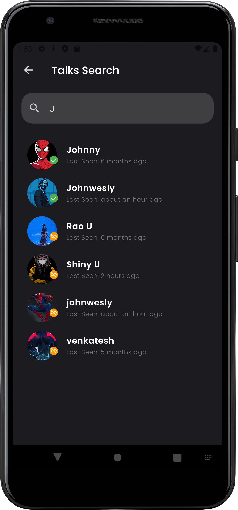

</div>

# Features 
### 1.User Login and Registration
 **Authentication** 
 - **Email-based Login:** Secure user authentication using Firebase
- Email and password Authentication for User Account to Talks Application

### 2.Real-Time Messaging
 - **Instant Messaging:** Send and receive messages in real-time with Firebase Firestore.
 - **Message Delivery Check:** Visual indicators for message delivery status (e.g., sent, delivered).
 - **Timestamps:** Messages are displayed with precise time and date of sending.

### 3.Push Notifications
 - **Firebase Messaging Integration:** Receive instant push notifications for new messages and updates, even when the app is in the background.

### 4.MultiMedia Support 
 - **Image Sharing:** Users can send and receive images seamlessly in chats.
 - **Emoji Support:** Enrich conversations with emojis for better expression.

### 5.User Status
 - **Online/Offline Status:** Real-time tracking of users' online and offline presence.

### 6.Personalization
 - **Customizable Themes:** Users can personalize the app with different themes to suit their preferences.
 - **Profile Management:** Update username, password, and other profile details directly from the app.

### 7.Additional Features
 - **Responsive Design:** Optimized for both Android, web and iOS devices.
 - **Scalable Backend:** Firebase provides a robust and scalable backend for handling user data and messaging efficiently.

# Folder Structure
The Project's Folder Structure is following: 
- `lib/` - Root directory containing all application files, including screen pages, modals, services, utilities, and reusable components.
   - **login_screen.dart** All screen files for the app are directly placed here, such as login_screen.dart, chat_screen.dart
   - `modals/` - Contains data models representing the application's core entities..
   - `repo/` -Acts as a repository layer for managing the interaction between the application and Firebase or other data sources.
   - `services/` -  Encapsulates business logic and Firebase service integration.
   - `utils/` - Provides utility functions and helpers used throughout the app.
   - `widgets/` - Contains reusable UI components for consistent design 
     - **chat_bubble.dart** A widget to display chat messages.
     - **Button.dart** A styled button widget.
- `assets/` - Stores fonts and images used in the application

- `android/` - Platform-specific configurations and assets
- `ios/` - Platform-specific configurations and assets
- `web/` - Platform-specific configurations and assets
- `windows/` - Platform-specific configurations and assets


# How to Install and run locally ?
 **Follow these steps to run the Talks Application locally:**
  - 1.Ensure you have the following installed on your system:
    - Flutter SDK: Install Flutter
    - Dart SDK: Comes with Flutter SDK.
    - Android Studio or Xcode: For Android or iOS development.
    - Device/Emulator: Physical device or emulator for testing.

  - 2.Create a Folder and Open the cmd terminal on your machine.
  - 3.Run this command:
   ```shell
   git clone https://github.com/johnwesly2002/Talks.git
   ```

  - 4.Wait for Git to Clone the repository to your Machine.

  - 5.Once the cloning process is complete, navigate to the project's root directory:

   ```shell
    cd Talks
   ```
  - 6.Run the following command to install the required Flutter packages:

   ```shell
   flutter pub get
   ```
  - 7.Make sure you have a simulator or a device set up for running the app

  - 8.If you still facing some issue for installing application try this command to checking the required dependencies.
    ```shell
    flutter doctor
    ```

### For Android

```bash
# using flutter
flutter run -d android
```

### For iOS

```bash
# using flutter
flutter run -d ios
```

If everything is set up _correctly_, you should see Talks app running in your _Android Emulator_ or _iOS Simulator_ shortly provided you have set up your emulator/simulator correctly.

This is one way to run Talks Application — you can also run it directly from within Android Studio and Xcode respectively.

## Congratulations! :tada:

You've successfully run Talks App. :partying_face:


